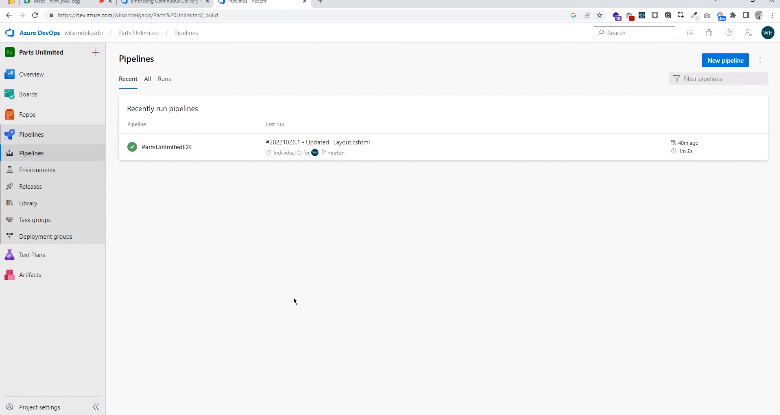

# LABORATORIO #6:
### Integrantes: Wilson Delgado, Juanita Oramas

- - -

#### .NET

Se hace la configuración especificada en los prerrequisitos

**Task 1**

Primero se comienzan creando todos los recursos, como la base de datos. Con las configuraciones respectivas del proyecto.

Se crea una *app service*, para el ambiente de QA y de producción, 

**Task 2**
Se elimina el release existente, ahora se crea un nuevo release usando el template **Azure App Service Deployment** para la etapa de QA.
Y se agrega un artefacto, el cual construye un proyecto a partir de PartsUnlimitedE2E y se procede a configurarlo, luego la etapa de QA también. 

Se habilita el trigger del despliegue continuo.

**Task 3**

Se procede a configurar el Web Site para que tenga conexión con la base de datos.
El proceso se hace tanto para el app service de QA como el de Producción.

**Task 4**

Se hace un cambio en uno de los archivos para verificar el despliegue y se genera un nuevo release.

**Task 5**

Se clona la etapa de QA

Se configura la gate de la etapa de QA. Se renombra a Prod

Se crea un nuevo cambio en los archivos y se verifica el despliegue. El critical bug generado, se arregla y se repite el proceso.

Se aprueba el despliegue a producción.

Progreso del despligue.

**Task 6**

Se configuran Slots de despliegue

Se hace Swap con el servidor de producción para que los cambios se envíen a este.

